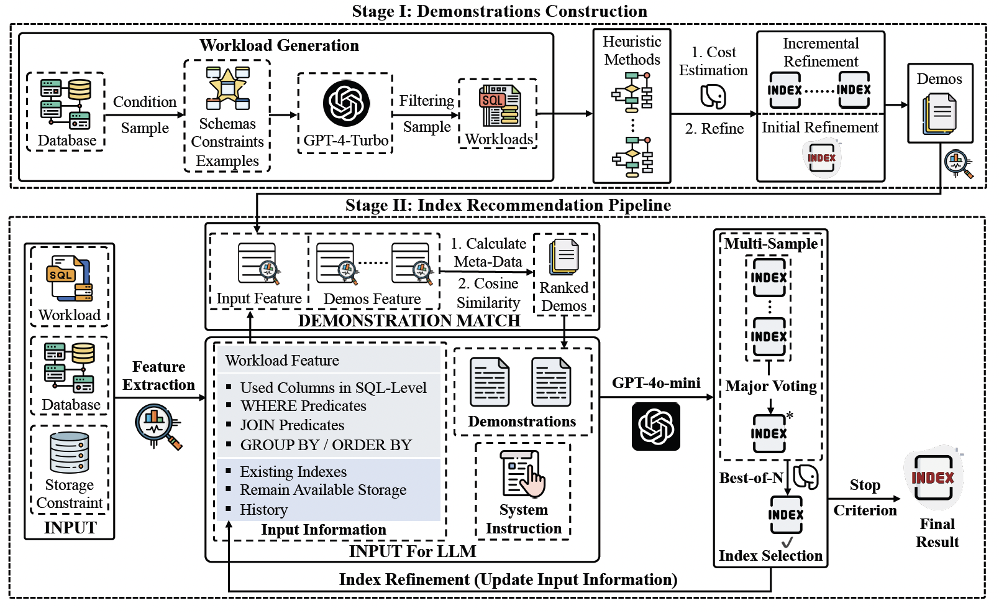

# LLMIdxAdvis: Resource-Efficient Index Advisor Utilizing Large Language Model

We propose an efficient and lightweight LLM-based index advisor, leveraging prompt engineering without extensive fine-tuning to efficiently recommend promising indexes.



## Environment Preparation

Our proposed method is implemented with the following environments:

- PostgreSQL : version 12.2.
- HypoPG extension for virtual index management.
- Python Environment : Anaconda3, Python version 3.11.5.

Step 1 : Download and install PostgreSQL 12.2.

```
sudo apt-get update
sudo apt-get install postgresql postgresql-client
```

Step 2 : Install the HypoPG extension according to https://github.com/HypoPG/hypopg. 

Step 3 : Create the virtual environment with Python = 3.11.5 and activate it.

```
conda create -n llmidxadvis python=3.11.5
conda activate llmidxadvis
```

Step 4 : Install the required packages.

```
pip install -r requirements.txt
```

## Supported Benchmarks

Owing to the characteristics of large language models, LLMIdxAdvis can theoretically support various workload compositions and database schemas. Based on the experimental attempts, we primarily offer two types of input format for the target workload (detailed in configuration file), involving OLAP and OLTP.

- For OLAP, we typically support the workloads where all SQL statements can be obtained, and take the ``workload.sql`` file path as input information.
- For OLTP, we set up the configuration specifically to support the OLTP benchmark `benchbase` (refer to https://github.com/cmu-db/benchbase), and take the benchmark name, the directory of transaction samples (under the folder ``./synthetic_data/workloads/oltp_samples``), the directory of  benchbase, the path of the configuration, and the ouput path of sampled benchbase workload as input information.

## Demonstration Pool

Our synthetic SQL queries and the extracted information of constructed demonstrations are under the folder `synthetic_data` and `demos_info` respectively. Meanwhile, we provide the code for demonstration construction under the folder  `demos_construct`,  which additionally requires the implementation of heuristic methods (refer to https://github.com/hyrise/index_selection_evaluation).

And the process of demonstrations contruction can be reproduced as follows:

```bash
python heuristics_gen.py
python demos_cost_exec.py
python demos_cost_trim.py
python demos_cost_refine.py
python json_agg_cost.py
```

## Using the LLMIdxAdvis

1. Modify the relevant configuration `./config/example_config.json`.

   ```
   {
       "db_name": "database_name",
       "schema": "schema_name",
       "type": "OLAP/OLTP",
       "AP_Config": {
           "workload_path": "workload_file_path (workload.sql)"
       },
       "TP_Config": {
           "benchmark": "benchmark_name(benchbase)",
           "workload_dir": "OLTP_sampled_transactions_directory(e g., ./synthetic_data/workloads/oltp_samples)",
           "benchmark_path": "dir/benchbase/target/benchbase-postgres",
           "benchmark_config": "dir/benchbase_config.xml",
           "workload_path": "workload_directory"
       },
       "num_of_iterations": 4,
       "index_storage_proportion": 0.5,
       "what_if": true/false,
       "mode": "index_infer/what_if/major_voting",
       "demos_match_method": "cos/random/cluster",
       "storage_gen": false/true,
       "num_of_actual_executions": 3,
       "num_of_samples": 8,
       "temperature": 0.6,
       "demos_num": 2,
       "model_name": "llm_model_name",
       "api_key": "api_key",
       "base_url": "llm_model_url",
       "demos_path": "demos_path(eg. './demos_info/all.json')"",
       "demos_meta_data_path": "meta_data_path (eg. ./demos_info/meta_data/all_cross_meta.json)",
       "demos_match_feat": 0/1/2/3/4/5,
       "detailed_info_path": "./log",
       "logger_console": "INFO",
       "logger_file": "INFO"
   }
   ```

2. Run the LLMIdxAdvis.

   ```
   cd llmidxadvis
   python main.py --config ./config/example_config.json
   ```
